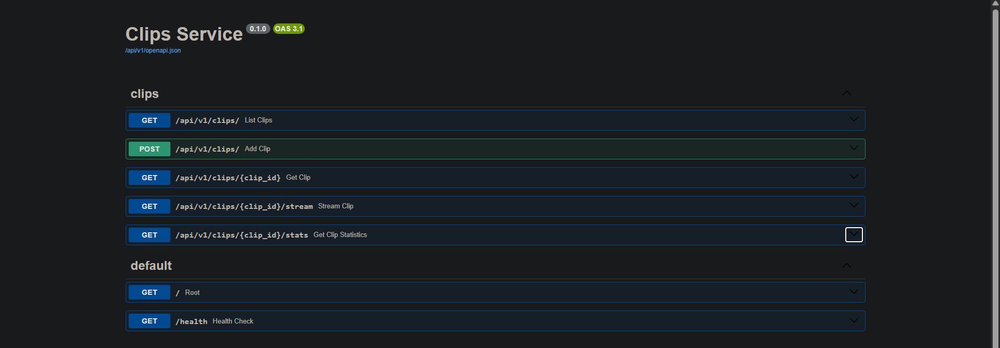
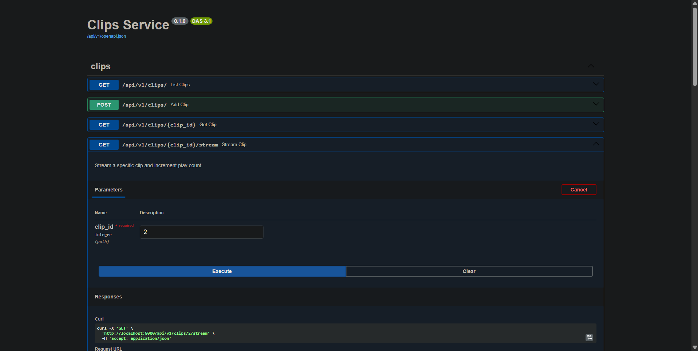
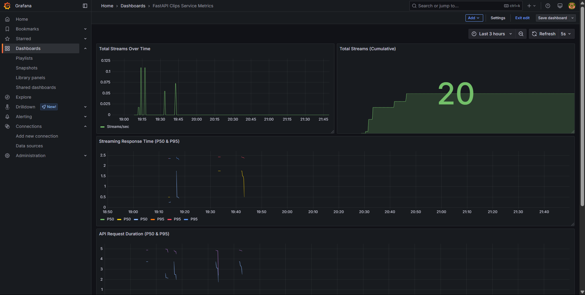
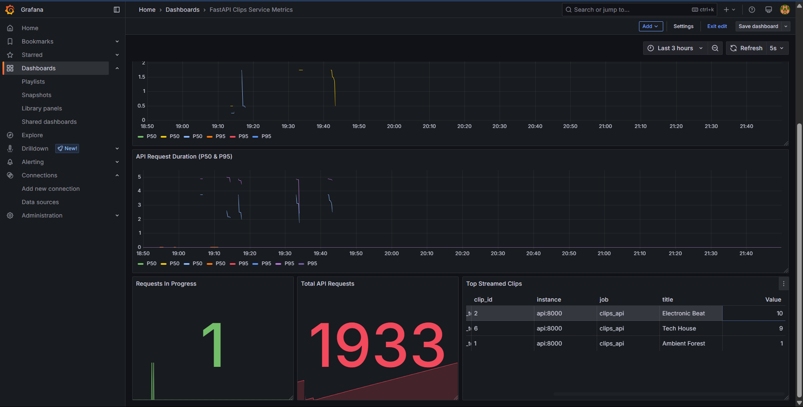
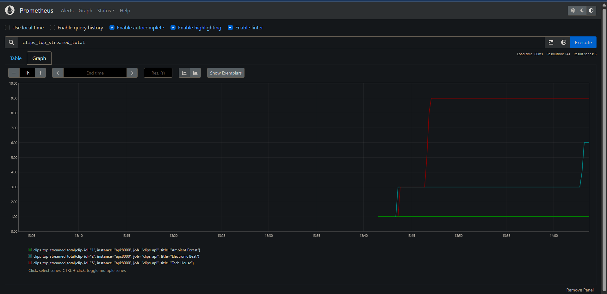

# Clips Service

A lightweight audio library API that lets users fetch and stream short audio previews. Built with FastAPI, PostgreSQL, and monitoring with Prometheus and Grafana.

## Features

- Get a list of available audio clips with metadata
- Stream specific audio clips
- Track play statistics
- Add new clips (metadata only)
- Monitoring with Prometheus and Grafana

## Tech Stack

- **FastAPI**: Modern, high-performance web framework
- **PostgreSQL**: Robust relational database
- **SQLAlchemy**: SQL toolkit and ORM
- **Pydantic**: Data validation and settings management
- **Docker & Docker Compose**: Containerization and orchestration
- **Prometheus**: Metrics collection
- **Grafana**: Metrics visualization

## Project Structure

```
clips_service/
├── app/
│   ├── __init__.py
│   ├── main.py          # FastAPI app entry point
│   ├── api/
│   │   ├── __init__.py
│   │   └── routes/
│   │       ├── __init__.py
│   │       └── clips.py  # API endpoints
│   ├── core/
│   │   ├── __init__.py
│   │   └── config.py    # Settings management
│   ├── db/
│   │   ├── __init__.py
│   │   ├── database.py  # DB connection
│   │   └── models.py    # SQLAlchemy models
│   ├── schemas/
│   │   ├── __init__.py
│   │   └── clips.py     # Pydantic schemas
│   └── services/
│       ├── __init__.py
│       └── clips.py     # Business logic
├── alembic/             # DB migrations
├── docker-compose.yml   # Docker setup
├── Dockerfile           # App containerization
├── requirements.txt     # Dependencies
├── .env.example         # Example environment variables
└── README.md            # Documentation
```

## Getting Started

### Prerequisites

- Docker and Docker Compose

### Setup & Installation

1. Clone the repository
2. Create a `.env` file based on `.env.example`:
   ```
   # Database settings
   POSTGRES_SERVER=db
   POSTGRES_USER=postgres
   POSTGRES_PASSWORD=postgres
   POSTGRES_DB=clips_db
   POSTGRES_PORT=5432
   ```
3. Run the application:
   ```bash
   docker-compose up --build
   ```

The services will be available at:
- API: http://localhost:8000
- API Documentation: http://localhost:8000/docs
- Prometheus: http://localhost:9090
- Grafana: http://localhost:3000 (admin/admin)

## API Endpoints

### List all clips
```
GET /api/v1/clips
```
Returns a list of all available audio clips with metadata.

### Get a specific clip
```
GET /api/v1/clips/{id}
```
Returns metadata for a specific clip.

### Stream a clip
```
GET /api/v1/clips/{id}/stream
```
Streams the audio file and increments the play count.

### Get clip statistics
```
GET /api/v1/clips/{id}/stats
```
Returns play count and other statistics for a specific clip.

### Add a new clip
```
POST /api/v1/clips
```
Add a new clip entry (metadata and URL only).

Request body:
```json
{
  "title": "New Clip",
  "description": "A description for the new clip",
  "genre": "electronic",
  "duration": 30.5,
  "audio_url": "https://example.com/path/to/audio.mp3"
}
```

## Monitoring

The project includes Prometheus for metrics collection and Grafana for visualization:

1. Access Grafana at http://localhost:3000
2. Login with admin/admin
3. Prometheus data source is pre-configured
4. The dashboard shows:
   - API request rates
   - Streaming response times
   - Total stream count
   - Top streamed clips

## Database

The PostgreSQL database is seeded with 6 sample clips on startup, including:
- Ambient sounds
- Electronic beats
- Acoustic guitar
- Rain sounds
- Jazz piano
- Tech house

## Screenshots

### 🖼️ 1. FastAPI docs
The APIs are available to test in the swagger UI.  


### 🖼️ 2. MP3 Streaming API   
The system streams the required clip and provides a download link.   


### 🖼️ 3. Grafana Dashboard  
The API service can be monitored based on Total Streams Over Time, Total Streams(Cumulative), Streaming Response Duration, API Request Duration

  
Requests in progress, Total API requests, and Top Streamed Clips are recorded.


### 🖼️ 4. Prometheus graph 
The clips_top_streamed_total metric is monitored.


---
